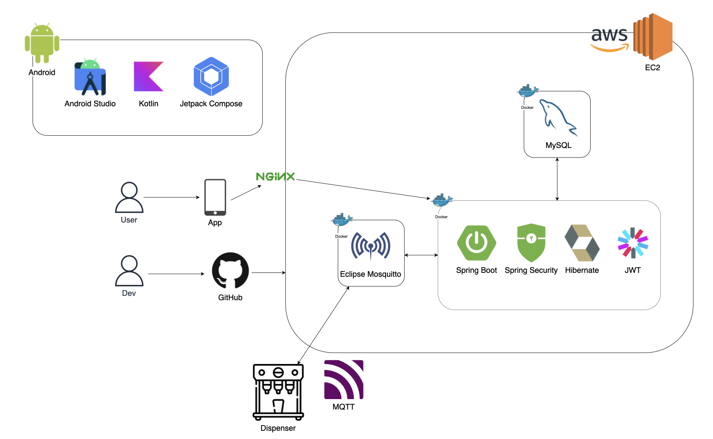
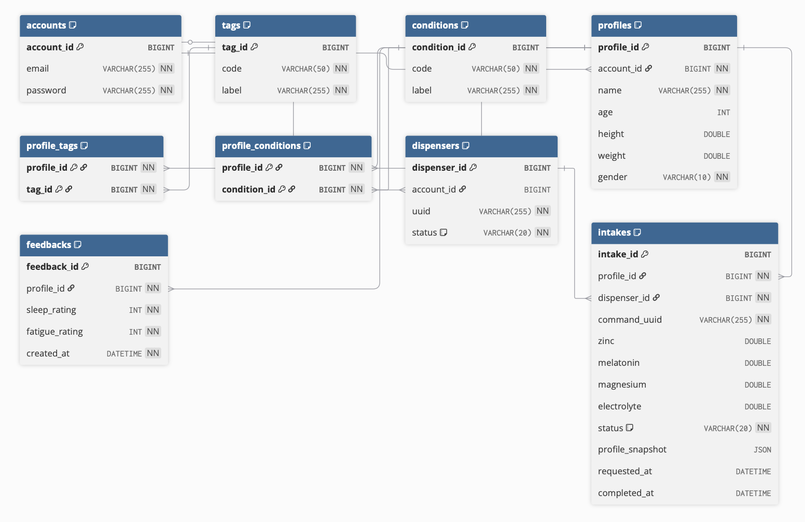

# Healthcare Dispenser Backend

> 개인 맞춤형 건강 관리 디스펜서 시스템의 백엔드 API 서버

## 📋 목차

- [프로젝트 개요](#프로젝트-개요)
- [기술 스택](#기술-스택)
- [아키텍처](#아키텍처)
- [주요 기능](#주요-기능)
- [API 문서](#api-문서)
- [ERD](#erd)
- [실행 방법](#실행-방법)
- [프로젝트 구조](#프로젝트-구조)

---

## 프로젝트 개요

### 해결하는 문제

- 개인별 건강 상태와 피드백을 기반으로 한 맞춤형 영양소 섭취 관리
- IoT 디스펜서와의 실시간 통신을 통한 자동화된 영양소 배출
- 사용자 프로필 기반 영양소 추천 및 섭취 기록 관리

### 대상 사용자 및 목적

- **대상 사용자**: 건강 관리를 위한 맞춤형 영양소 섭취가 필요한 개인 및 가족
- **목적**: 나이, 성별, 신체 정보, 건강 상태, 피드백을 종합하여 최적의 영양소 배출량을 계산하고 디스펜서를 제어

---

## 기술 스택

### 언어 및 프레임워크
- **Java 21**
- **Spring Boot 3.5.5**
- **Spring Security** - 인증/인가
- **Spring Data JPA** - 데이터 영속성

### 라이브러리
- **JWT (jjwt 0.12.6)** - 토큰 기반 인증
- **Eclipse Paho MQTT Client 1.2.5** - MQTT 통신
- **QueryDSL 5.1.0** - 타입 안전 쿼리
- **Lombok** - 보일러플레이트 코드 제거
- **SpringDoc OpenAPI 2.8.9** - API 문서화

### 데이터베이스
- **MySQL 8.0** - 메인 데이터베이스

### 인프라
- **Docker & Docker Compose** - 컨테이너 오케스트레이션
- **Eclipse Mosquitto 2** - MQTT 브로커
- **Nginx 1.27** - 리버스 프록시

---

## 아키텍처

### 전체 시스템 구조

<div style="position: relative;">
  
  <pre style="display: none;"><code>┌──────────────┐
│  Mobile App  │
└──────┬───────┘
       │ HTTPS
       ▼
┌──────────────┐
│    Nginx     │ (Reverse Proxy)
└──────┬───────┘
       │
       ▼
┌──────────────────────────┐
│  Spring Boot Backend     │
│  ┌────────────────────┐  │
│  │ REST Controllers   │  │
│  └─────────┬──────────┘  │
│            │              │
│  ┌─────────▼──────────┐  │
│  │  Service Layer    │  │
│  └─────────┬──────────┘  │
│            │              │
│  ┌─────────▼──────────┐  │
│  │ Repository Layer   │  │
│  └─────────┬──────────┘  │
└────────────┼──────────────┘
             │
    ┌────────┴────────┐
    │                 │
    ▼                 ▼
┌──────────┐    ┌───────────────┐
│  MySQL   │    │  MQTT Broker  │
└──────────┘    └───────┬───────┘
                        │
                        ▼
                ┌───────────────┐
                │   Dispenser   │ (IoT Device)
                └───────────────┘</code></pre>
</div>

### 백엔드 내부 레이어 구조

```
Controller Layer (REST API)
    ↓
Service Layer (비즈니스 로직)
    ↓
Repository Layer (데이터 접근)
    ↓
Domain Layer (엔티티)
```

**주요 패키지 구조:**
- `account` - 계정 관리 (회원가입, 로그인)
- `profile` - 사용자 프로필 관리
- `dispenser` - 디스펜서 등록 및 제어
- `intake` - 섭취 기록 및 피드백
- `common` - 공통 기능 (JWT, MQTT, Security)
- `rule` - 영양소 추천 규칙 엔진

---

## 주요 기능

### API 종류

#### 1. 인증 (Account)
- 회원가입: `POST /api/accounts/signup`
- 로그인: `POST /api/accounts/login`
- JWT 토큰 기반 인증

#### 2. 프로필 (Profile)
- 프로필 목록 조회: `GET /api/profiles`
- 프로필 생성: `POST /api/profiles`
- 프로필 수정: `PATCH /api/profiles/{profileId}`
- 프로필 삭제: `DELETE /api/profiles/{profileId}`
- 프로필 상세 조회: `GET /api/profiles/{profileId}`
- 태그 목록 조회: `GET /api/tags`
- 건강 상태 목록 조회: `GET /api/conditions`

#### 3. 디스펜서 (Dispenser)
- 디스펜서 등록: `POST /api/dispensers` (QR → MQTT)
- 디스펜서 계정 연결: `POST /api/dispensers`
- 세척 요청: `POST /api/dispensers/{dispenserUuid}/wash/{slot}`

#### 4. 섭취 기록 (Intake)
- 배출 명령 요청: `POST /api/intakes`
- 섭취 기록 조회: `GET /api/profiles/{profileId}/intakes`
- 추천 영양소 조회: `GET /api/profiles/{profileId}/recommend`
- 명령 상태 조회: `GET /api/intakes/{intakeId}`

#### 5. 피드백 (Feedback)
- 피드백 등록: `POST /api/profiles/{profileId}/feedbacks`
- 피드백 목록 조회: `GET /api/profiles/{profileId}/feedbacks`
- 피드백 상세 조회: `GET /api/profiles/{profileId}/feedbacks/{feedbackId}`

### 핵심 기능

- ✅ **JWT 기반 인증**: Access Token을 통한 인증/인가
- ✅ **MQTT 실시간 통신**: 디스펜서와의 양방향 통신
  - 디스펜서 등록 (QR → MQTT)
  - 배출 명령 전송
  - 명령 응답 수신
- ✅ **규칙 기반 추천 엔진**: 프로필 + 피드백 기반 영양소 계산
- ✅ **프로필 스냅샷**: 섭취 시점의 프로필 정보 저장
- ✅ **QueryDSL**: 복잡한 쿼리 타입 안전성 보장

---

## API 문서

<details>
<summary>📚 주요 엔드포인트 상세 문서 (클릭하여 펼치기)</summary>

### 주요 엔드포인트

#### 1. 회원가입

```http
POST /api/accounts/signup
Content-Type: application/json

{
  "email": "user@example.com",
  "password": "password123",
  "passwordConfirm": "password123"
}
```

**응답:**
```json
{
  "accountId": 1,
  "email": "user@example.com",
  "token": "eyJhbGciOiJIUzI1NiIsInR5cCI6IkpXVCJ9..."
}
```

#### 2. 로그인

```http
POST /api/accounts/login
Content-Type: application/json

{
  "email": "user@example.com",
  "password": "password123"
}
```

**응답:**
```json
{
  "accountId": 1,
  "email": "user@example.com",
  "token": "eyJhbGciOiJIUzI1NiIsInR5cCI6IkpXVCJ9..."
}
```

#### 3. 프로필 생성

```http
POST /api/profiles
Authorization: Bearer {token}
Content-Type: application/json

{
  "name": "홍길동",
  "age": 30,
  "height": 175.0,
  "weight": 70.0,
  "gender": "MALE",
  "tags": ["ATHLETE"],
  "conditions": []
}
```

**응답:**
```json
{
  "profileId": 1,
  "name": "홍길동"
}
```

#### 4. 추천 영양소 조회

```http
GET /api/profiles/{profileId}/recommend
Authorization: Bearer {token}
```

**응답:**
```json
{
  "zinc": 15.0,
  "melatonin": 3.0,
  "magnesium": 400.0,
  "electrolyte": 500.0
}
```

#### 5. 배출 명령 요청

```http
POST /api/intakes
Authorization: Bearer {token}
Content-Type: application/json

{
  "profileId": 1,
  "dispenserUuid": "TEST-UUID"
}
```

**응답:**
```json
{
  "intakeId": 1,
  "status": "PROCESSING"
}
```

#### 6. 섭취 기록 조회

```http
GET /api/profiles/{profileId}/intakes
Authorization: Bearer {token}
```

**응답:**
```json
{
  "list": [
    {
      "intakeId": 1,
      "zinc": 15.0,
      "melatonin": 3.0,
      "magnesium": 400.0,
      "electrolyte": 500.0,
      "status": "SUCCESS",
      "requestedAt": "2024-01-15T10:30:00",
      "completedAt": "2024-01-15T10:30:05"
    }
  ],
  "total": 1
}
```

#### 7. 피드백 등록

```http
POST /api/profiles/{profileId}/feedbacks
Authorization: Bearer {token}
Content-Type: application/json

{
  "sleepQuality": 4,
  "fatigueLevel": 3
}
```

**응답:**
```json
{
  "feedbackId": 1,
  "sleepRating": 4,
  "fatigueRating": 3,
  "createdAt": "2024-01-15T10:30:00"
}
```

#### 8. 디스펜서 연결

```http
POST /api/dispensers
Authorization: Bearer {token}
Content-Type: application/json

{
  "uuid": "TEST-UUID"
}
```

**응답:**
```json
{
  "accountId": 1,
  "uuid": "TEST-UUID"
}
```

#### 9. 프로필 목록 조회

```http
GET /api/profiles
Authorization: Bearer {token}
```

**응답:**
```json
{
  "list": [
    {
      "profileId": 1,
      "name": "홍길동"
    }
  ],
  "total": 1
}
```

#### 10. 명령 상태 조회

```http
GET /api/intakes/{intakeId}
Authorization: Bearer {token}
```

**응답:**
```json
{
  "intakeId": 1,
  "status": "SUCCESS"
}
```

### 에러 응답 구조

```json
{
  "error": "Bad Request",
  "message": "유효하지 않은 요청입니다.",
  "status": 400,
  "timestamp": "2024-01-15T10:30:00"
}
```

**주요 HTTP 상태 코드:**
- `200 OK` - 성공
- `201 Created` - 리소스 생성 성공
- `204 No Content` - 삭제 성공
- `400 Bad Request` - 잘못된 요청
- `401 Unauthorized` - 인증 실패
- `403 Forbidden` - 권한 없음
- `404 Not Found` - 리소스 없음
- `500 Internal Server Error` - 서버 오류

</details>

---

## ERD

### 데이터베이스 다이어그램

<div style="position: relative;">
  
  <pre style="display: none;"><code>┌──────────────┐
│   accounts   │
├──────────────┤
│ account_id   │ PK
│ email        │
│ password     │
└──────┬───────┘
       │ 1
       │
       │ N
┌──────▼───────┐
│   profiles   │
├──────────────┤
│ profile_id   │ PK
│ account_id   │ FK → accounts
│ name         │
│ age          │
│ height       │
│ weight       │
│ gender       │
└──────┬───────┘
       │ 1
       │
       │ N
┌──────▼─────────────┐      ┌──────────────┐
│   profile_tags     │      │     tags     │
├────────────────────┤      ├──────────────┤
│ profile_id         │ FK   │ tag_id       │ PK
│ tag_id             │ FK   │ code         │
│                    │      │ label        │
└────────────────────┘      └──────────────┘
       │                            │
       └────────────────────────────┘

┌─────────────────────┐     ┌──────────────┐
│ profile_conditions  │      │  conditions  │
├─────────────────────┤      ├──────────────┤
│ profile_id         │ FK  │ condition_id │ PK
│ condition_id       │ FK  │ code         │
│                    │      │ label        │
└─────────────────────┘      └──────────────┘
       │                            │
       └────────────────────────────┘

┌──────────────┐
│  dispensers   │
├──────────────┤
│ dispenser_id │ PK
│ account_id   │ FK → accounts
│ uuid         │
│ status       │
└──────┬───────┘
       │ 1
       │
       │ N
┌──────▼───────┐
│   intakes    │
├──────────────┤
│ intake_id    │ PK
│ profile_id   │ FK → profiles
│ dispenser_id │ FK → dispensers
│ command_uuid │
│ zinc         │
│ melatonin    │
│ magnesium    │
│ electrolyte  │
│ status       │
│ profile_snapshot │ (JSON)
│ requested_at │
│ completed_at │
└──────┬───────┘
       │ 1
       │
       │ N
┌──────▼──────────┐
│   feedbacks     │
├─────────────────┤
│ feedback_id     │ PK
│ profile_id      │ FK → profiles
│ sleep_rating    │
│ fatigue_rating  │
│ created_at      │
└─────────────────┘</code></pre>
</div>

### 주요 엔티티 설명

#### Account
- 사용자 계정 정보
- 이메일/비밀번호 기반 인증

#### Profile
- 사용자 프로필 정보
- 나이, 신장, 체중, 성별
- 태그(Tag) 및 건강 상태(Condition) 다대다 관계

#### Dispenser
- 디스펜서 디바이스 정보
- UUID로 디바이스 식별
- 계정과 1:1 관계 (선택적)

#### Intake
- 영양소 섭취 기록
- 프로필과 디스펜서에 연결
- 배출 명령 상태 추적
- 프로필 스냅샷 저장

#### Feedback
- 사용자 피드백 (수면 품질, 피로도)
- 규칙 엔진의 입력 데이터로 활용

#### Tag / Condition
- 프로필의 태그 및 건강 상태 코드
- 영양소 추천 규칙에 영향

---

## 실행 방법

<details>
<summary>🚀 실행 방법 상세 가이드 (클릭하여 펼치기)</summary>

### 로컬 실행 (Spring Boot)

#### 1. 사전 요구사항
- Java 21 이상
- Gradle 8.x 이상
- MySQL 8.0

#### 2. 환경 변수 설정

`.env` 파일 생성:

```properties
# MySQL
MYSQL_HOST=localhost
MYSQL_PORT=3306
MYSQL_DATABASE=dispenser
MYSQL_USER=root
MYSQL_PASSWORD=your_password
MYSQL_ROOT_PASSWORD=your_root_password

# JWT
JWT_SECRET_KEY=your-secret-key-min-256-bits

# MQTT
MQTT_PORT=1883

# Redis (선택)
REDIS_HOST=localhost
REDIS_PORT=6379
```

#### 3. 애플리케이션 실행

```bash
# Gradle Wrapper 사용
./gradlew bootRun

# 또는 JAR 빌드 후 실행
./gradlew build
java -jar build/libs/dispenser-0.0.1-SNAPSHOT.jar
```

애플리케이션은 `http://localhost:8080`에서 실행됩니다.

### Docker Compose 실행

#### 1. 환경 변수 설정

`.env` 파일을 프로젝트 루트에 생성:

```properties
# MySQL
MYSQL_ROOT_PASSWORD=rootpassword
MYSQL_DATABASE=dispenser
MYSQL_USER=dispenser
MYSQL_PASSWORD=dispenser123
MYSQL_PORT=3306

# MQTT
MQTT_PORT=1883

# JWT
JWT_SECRET_KEY=your-secret-key-min-256-bits-for-production-use

# Redis (선택)
REDIS_HOST=localhost
REDIS_PORT=6379
```

#### 2. Docker Compose 실행

```bash
# 서비스 시작
docker-compose up -d

# 로그 확인
docker-compose logs -f

# 서비스 중지
docker-compose down

# 볼륨 포함 삭제
docker-compose down -v
```

#### 3. 서비스 접속 정보

- **MySQL**: `localhost:3306`
- **MQTT Broker**: `localhost:1883`
- **Nginx**: `localhost:80` → Spring Boot (8080) 프록시

### Swagger UI

애플리케이션 실행 후 다음 URL에서 API 문서 확인:

```
http://localhost:8080/swagger-ui.html
```

</details>

---

## 프로젝트 구조

```
dispenser/
├── src/
│   ├── main/
│   │   ├── java/kr/ac/suwon/dispenser/
│   │   │   ├── account/          # 계정 관리
│   │   │   │   ├── controller/
│   │   │   │   ├── domain/
│   │   │   │   ├── dto/
│   │   │   │   ├── repository/
│   │   │   │   └── service/
│   │   │   ├── common/           # 공통 기능
│   │   │   │   ├── jwt/          # JWT 인증
│   │   │   │   ├── mqtt/         # MQTT 통신
│   │   │   │   ├── SecurityConfig.java
│   │   │   │   └── GlobalExceptionHandler.java
│   │   │   ├── dispenser/       # 디스펜서 관리
│   │   │   │   ├── controller/
│   │   │   │   ├── domain/
│   │   │   │   ├── dto/
│   │   │   │   ├── repository/
│   │   │   │   └── service/
│   │   │   ├── intake/           # 섭취 기록
│   │   │   │   ├── controller/
│   │   │   │   ├── domain/
│   │   │   │   ├── dto/
│   │   │   │   ├── repository/
│   │   │   │   └── service/
│   │   │   ├── profile/          # 프로필 관리
│   │   │   │   ├── controller/
│   │   │   │   ├── domain/
│   │   │   │   │   ├── condition/
│   │   │   │   │   └── tag/
│   │   │   │   ├── dto/
│   │   │   │   ├── repository/
│   │   │   │   └── service/
│   │   │   ├── rule/             # 규칙 엔진
│   │   │   │   ├── RuleContext.java
│   │   │   │   └── RuleEngine.java
│   │   │   ├── DispenserApplication.java
│   │   │   └── DbInit.java       # 초기 데이터
│   │   └── resources/
│   │       ├── application.yml
│   │       └── static/
│   └── test/
├── infra/
│   ├── mosquitto/
│   │   └── mosquitto.conf
│   └── nginx/
│       └── nginx.conf
├── build.gradle
├── docker-compose.yml
├── settings.gradle
└── README.md
```

---

## 라이선스

이 프로젝트는 수원대학교 프로젝트입니다.

---

## 기여

이슈 및 개선 사항은 GitHub Issues를 통해 제안해주세요.

